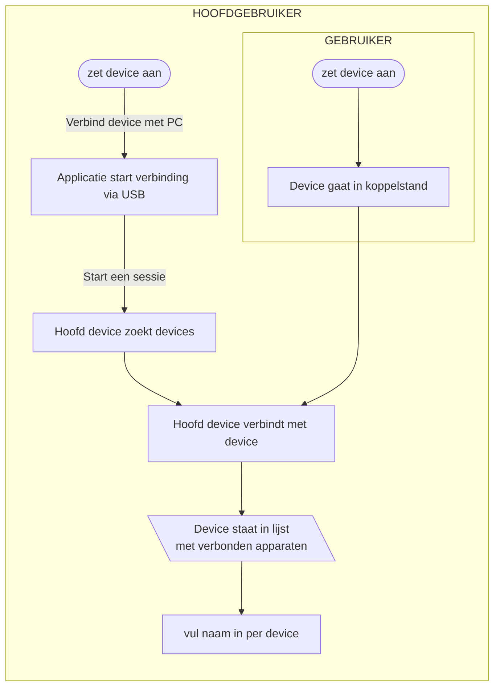

```mermaid
flowchart LR
    subgraph HOOFDGEBRUIKER
    POWERON([zet device aan]) -->|Verbind device met PC| START
        START[Applicatie start verbinding via USB] -->|Start een sessie| SEARCH
        SEARCH[Hoofd device zoekt devices] --> PAIR
    
    subgraph GEBRUIKER
    GSTART([zet device aan]) --> GPAIR
    end
        GPAIR[Device gaat in koppelstand] ---> PAIR
    
    
    PAIR[Hoofd device verbindt met device] -->
        LIST[\Device staat in lijst<Br> met verbonden apparaten\] -->
            NAME[vul naam in per device]
    end
```
