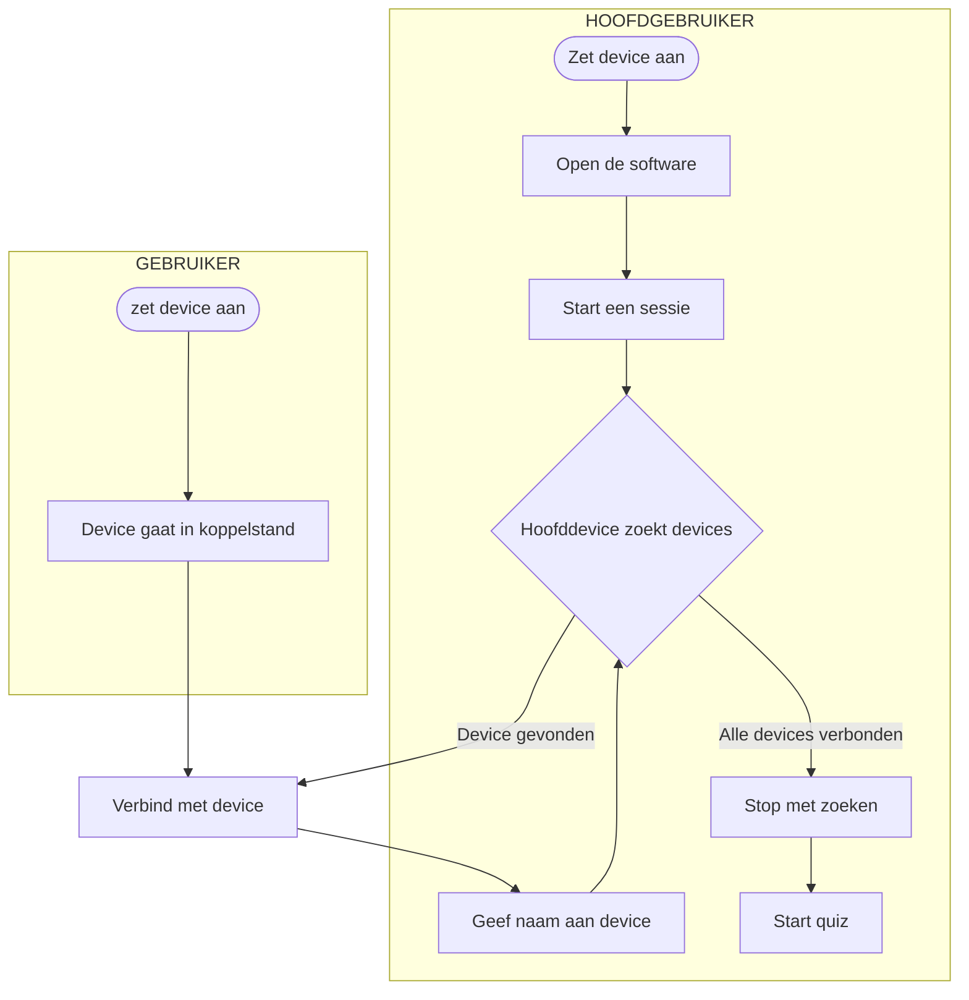

# Betaalbare interactieve manier van leren

## Definities
Hoofdgebruiker - Degene die de quiz presenteert
Gebruiker - Degenen die antwoorden zullen invoeren

Device - Apparaat dat wordt gebruikt om de antwoorden in te voeren
Hoofddevice - Apparaat dat is verbonden aan de computer en de andere devices aanstuurt

## Functioneel ontwerp
### Flowchart
